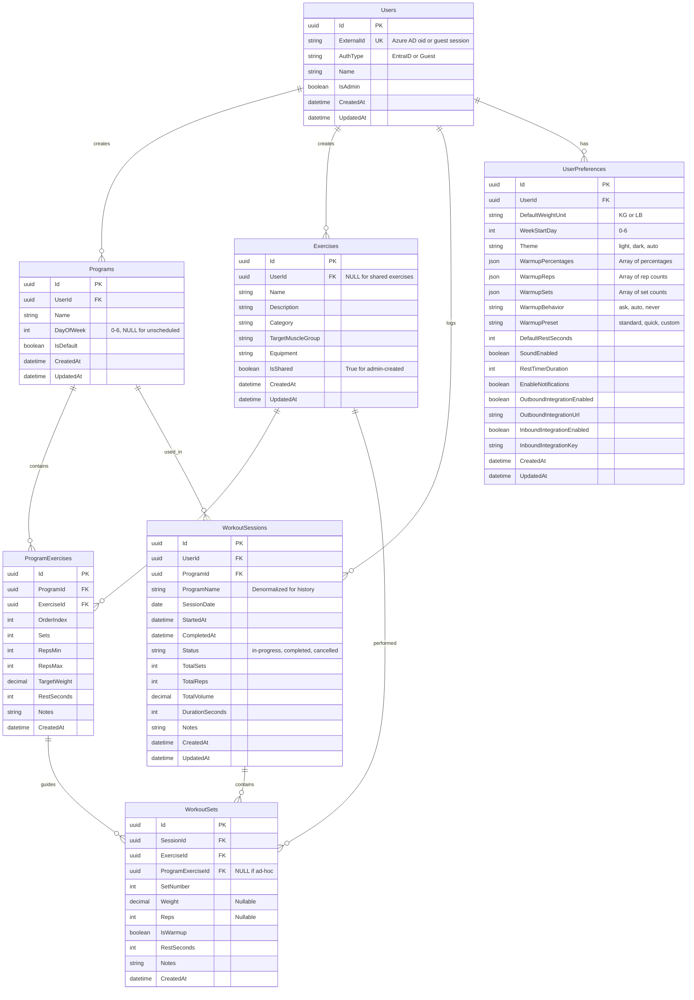

# Gym Logger Database Design

## Executive Summary

This document outlines the database design for Gym Logger application, moving from file-system based storage to a proper relational database.

## Database Schema Design

### Entity Relationship Diagram



### Core Tables Details

#### Users Table
```sql
CREATE TABLE Users (
    Id TEXT PRIMARY KEY,                    -- GUID as string
    ExternalId TEXT NOT NULL UNIQUE,        -- Azure AD oid or guest session ID
    AuthType TEXT NOT NULL,                 -- 'EntraID' or 'Guest'
    Name TEXT NOT NULL,
    IsAdmin INTEGER NOT NULL DEFAULT 0,     -- SQLite uses INTEGER for boolean
    CreatedAt TEXT NOT NULL,                -- ISO 8601 datetime
    UpdatedAt TEXT
);

CREATE INDEX idx_users_externalid ON Users(ExternalId);
```

#### Exercises Table
```sql
CREATE TABLE Exercises (
    Id TEXT PRIMARY KEY,
    UserId TEXT,                            -- NULL for shared exercises
    Name TEXT NOT NULL,
    Description TEXT,
    Category TEXT,                          -- e.g., 'Strength', 'Cardio'
    TargetMuscleGroup TEXT,                 -- e.g., 'Chest', 'Back'
    Equipment TEXT,                         -- e.g., 'Barbell', 'Dumbbell'
    IsShared INTEGER NOT NULL DEFAULT 0,
    CreatedAt TEXT NOT NULL,
    UpdatedAt TEXT,
    FOREIGN KEY (UserId) REFERENCES Users(Id) ON DELETE CASCADE
);

CREATE INDEX idx_exercises_userid ON Exercises(UserId);
CREATE INDEX idx_exercises_shared ON Exercises(IsShared) WHERE IsShared = 1;
CREATE INDEX idx_exercises_category ON Exercises(Category);
CREATE INDEX idx_exercises_musclegroup ON Exercises(TargetMuscleGroup);
```

#### Programs Table
```sql
CREATE TABLE Programs (
    Id TEXT PRIMARY KEY,
    UserId TEXT NOT NULL,
    Name TEXT NOT NULL,
    DayOfWeek INTEGER,                      -- 0-6, NULL for unscheduled
    IsDefault INTEGER NOT NULL DEFAULT 0,
    CreatedAt TEXT NOT NULL,
    UpdatedAt TEXT,
    FOREIGN KEY (UserId) REFERENCES Users(Id) ON DELETE CASCADE
);

CREATE INDEX idx_programs_userid ON Programs(UserId);
CREATE INDEX idx_programs_dayofweek ON Programs(DayOfWeek);
CREATE UNIQUE INDEX idx_programs_user_default ON Programs(UserId) 
    WHERE IsDefault = 1;
```

#### ProgramExercises Table
```sql
CREATE TABLE ProgramExercises (
    Id TEXT PRIMARY KEY,
    ProgramId TEXT NOT NULL,
    ExerciseId TEXT NOT NULL,
    OrderIndex INTEGER NOT NULL,
    Sets INTEGER NOT NULL,
    RepsMin INTEGER NOT NULL,
    RepsMax INTEGER NOT NULL,
    TargetWeight REAL,
    RestSeconds INTEGER,
    Notes TEXT,
    CreatedAt TEXT NOT NULL,
    FOREIGN KEY (ProgramId) REFERENCES Programs(Id) ON DELETE CASCADE,
    FOREIGN KEY (ExerciseId) REFERENCES Exercises(Id) ON DELETE RESTRICT
);

CREATE INDEX idx_programexercises_programid ON ProgramExercises(ProgramId);
CREATE INDEX idx_programexercises_exerciseid ON ProgramExercises(ExerciseId);
CREATE UNIQUE INDEX idx_programexercises_order 
    ON ProgramExercises(ProgramId, OrderIndex);
```

#### WorkoutSessions Table
```sql
CREATE TABLE WorkoutSessions (
    Id TEXT PRIMARY KEY,
    UserId TEXT NOT NULL,
    ProgramId TEXT NOT NULL,
    ProgramName TEXT NOT NULL,              -- Denormalized for history
    SessionDate TEXT NOT NULL,              -- DATE only
    StartedAt TEXT NOT NULL,
    CompletedAt TEXT,
    Status TEXT NOT NULL,                   -- 'in-progress', 'completed', 'cancelled'
    TotalSets INTEGER NOT NULL DEFAULT 0,
    TotalReps INTEGER NOT NULL DEFAULT 0,
    TotalVolume REAL NOT NULL DEFAULT 0,
    DurationSeconds INTEGER,
    Notes TEXT,
    CreatedAt TEXT NOT NULL,
    UpdatedAt TEXT,
    FOREIGN KEY (UserId) REFERENCES Users(Id) ON DELETE CASCADE,
    FOREIGN KEY (ProgramId) REFERENCES Programs(Id) ON DELETE RESTRICT
);

CREATE INDEX idx_sessions_userid ON WorkoutSessions(UserId);
CREATE INDEX idx_sessions_programid ON WorkoutSessions(ProgramId);
CREATE INDEX idx_sessions_date ON WorkoutSessions(SessionDate);
CREATE INDEX idx_sessions_status ON WorkoutSessions(Status);
CREATE INDEX idx_sessions_user_date ON WorkoutSessions(UserId, SessionDate);
```

#### WorkoutSets Table
```sql
CREATE TABLE WorkoutSets (
    Id TEXT PRIMARY KEY,
    SessionId TEXT NOT NULL,
    ExerciseId TEXT NOT NULL,
    ProgramExerciseId TEXT,                 -- NULL for ad-hoc sets
    SetNumber INTEGER NOT NULL,
    Weight REAL,                            -- Nullable
    Reps INTEGER,                           -- Nullable
    IsWarmup INTEGER NOT NULL DEFAULT 0,
    RestSeconds INTEGER,
    Notes TEXT,
    CreatedAt TEXT NOT NULL,
    FOREIGN KEY (SessionId) REFERENCES WorkoutSessions(Id) ON DELETE CASCADE,
    FOREIGN KEY (ExerciseId) REFERENCES Exercises(Id) ON DELETE RESTRICT,
    FOREIGN KEY (ProgramExerciseId) REFERENCES ProgramExercises(Id) ON DELETE SET NULL
);

CREATE INDEX idx_sets_sessionid ON WorkoutSets(SessionId);
CREATE INDEX idx_sets_exerciseid ON WorkoutSets(ExerciseId);
CREATE INDEX idx_sets_programexerciseid ON WorkoutSets(ProgramExerciseId);
```

#### UserPreferences Table
```sql
CREATE TABLE UserPreferences (
    Id TEXT PRIMARY KEY,
    UserId TEXT NOT NULL UNIQUE,
    DefaultWeightUnit TEXT NOT NULL DEFAULT 'KG',
    WeekStartDay INTEGER NOT NULL DEFAULT 0,
    Theme TEXT NOT NULL DEFAULT 'auto',
    WarmupPercentages TEXT NOT NULL DEFAULT '[50,60,70,80,90]',  -- JSON array
    WarmupReps TEXT NOT NULL DEFAULT '[5,5,3,2,1]',               -- JSON array
    WarmupSets TEXT NOT NULL DEFAULT '[2,1,1,1,1]',               -- JSON array
    WarmupBehavior TEXT NOT NULL DEFAULT 'ask',
    WarmupPreset TEXT NOT NULL DEFAULT 'standard',
    DefaultRestSeconds INTEGER NOT NULL DEFAULT 90,
    SoundEnabled INTEGER NOT NULL DEFAULT 1,
    RestTimerDuration INTEGER NOT NULL DEFAULT 90,
    EnableNotifications INTEGER NOT NULL DEFAULT 1,
    OutboundIntegrationEnabled INTEGER NOT NULL DEFAULT 0,
    OutboundIntegrationUrl TEXT,
    InboundIntegrationEnabled INTEGER NOT NULL DEFAULT 0,
    InboundIntegrationKey TEXT,
    CreatedAt TEXT NOT NULL,
    UpdatedAt TEXT,
    FOREIGN KEY (UserId) REFERENCES Users(Id) ON DELETE CASCADE
);

CREATE UNIQUE INDEX idx_preferences_userid ON UserPreferences(UserId);
```

---

## Migration Strategy

### Phase 1: Dual Storage (Transition Period)
1. Implement database layer with Entity Framework Core
2. Keep file-system repositories as fallback
3. Write to both systems during migration
4. Gradually migrate existing data

### Phase 2: Data Migration Script
```csharp
public class FileSystemToDbMigrator
{
    // Read from data/*.json files
    // Transform to database entities
    // Bulk insert into SQLite
    // Validate data integrity
    // Archive old JSON files
}
```

### Phase 3: Database-Only Operation
1. Remove file-system repositories
2. Update all services to use EF Core
3. Archive old data files
4. Monitor performance

---

## Performance Considerations

### Indexing Strategy
- **Primary Keys:** All tables use GUID as primary key (clustered in SQL Server)
- **Foreign Keys:** All foreign keys have indexes
- **Date Queries:** SessionDate and CreatedAt indexed for history queries
- **User Queries:** UserId indexed on all user-owned entities
- **Partial Indexes:** Used for unique constraints (e.g., one default program per user)

### Query Optimization
- Use SELECT only needed columns (avoid SELECT *)
- Implement pagination for list queries
- Use compiled queries for frequently-run operations
- Cache frequently accessed data (exercises, preferences)

### Connection Management
- Use connection pooling (enabled by default in EF Core)
- Dispose DbContext properly (use using statements)
- Consider DBContext pooling for high-traffic scenarios

---

## Backup and Recovery Strategy

### SQLite Backup
```bash
# Automated backup script
sqlite3 /home/data/gymlogger.db ".backup /home/backups/gymlogger_$(date +%Y%m%d_%H%M%S).db"

# Retention policy
# - Daily backups: Keep 7 days
# - Weekly backups: Keep 4 weeks
# - Monthly backups: Keep 12 months
```

### Azure SQL Backup
- Automatic backups enabled (built-in feature)
- Point-in-time restore available (7-35 days)
- Long-term retention policy for compliance

---

## Security Considerations

### Data Protection
- ✅ User data isolation via UserId foreign keys
- ✅ Cascade delete for user-owned data
- ✅ Restrict delete on referenced entities (Programs, Exercises)
- ✅ Row-level security not needed (application enforces authorization)

### Connection Security
- **SQLite:** File system permissions (chmod 600)
- **Azure SQL:** TLS encryption, firewall rules, managed identity

### Sensitive Data
- No passwords stored (authentication via Azure AD/cookies)
- Personal data: Name, workout history
- Consider GDPR compliance for EU users (data export, deletion)

---

## Monitoring and Maintenance

### Health Checks
- Database connectivity check
- Storage space monitoring (SQLite file size)
- Query performance logging (slow query log)
- Connection pool statistics

### Maintenance Tasks
- **SQLite:** VACUUM command (reclaim space) - monthly
- **Azure SQL:** Automatic maintenance by Azure
- **Both:** Monitor database growth, archive old sessions (>1 year)

---

## Cost Analysis (Monthly Estimates)

### SQLite Option
| Component | Cost |
|-----------|------|
| Azure App Service (B1) | $13 |
| Persistent Storage | $0.20/GB |
| **Total** | **~$13.20** |

### Azure SQL Option
| Component | Cost |
|-----------|------|
| Azure App Service (B1) | $13 |
| Azure SQL (Basic) | $5 |
| **Total** | **~$18** |

### Recommendation
Start with **SQLite** for $13.20/month. Migrate to **Azure SQL** when:
- User base exceeds 100 concurrent users
- Data size exceeds 50GB
- Need multi-instance scaling
- Require advanced analytics/reporting

---

## Implementation Roadmap

### Week 1: Database Setup
- [ ] Install Entity Framework Core packages
- [ ] Create entity models matching diagram
- [ ] Set up DbContext with SQLite provider
- [ ] Create initial migration
- [ ] Test local database creation

### Week 2: Repository Layer
- [ ] Implement repository pattern with EF Core
- [ ] Create unit of work pattern
- [ ] Write unit tests for repositories
- [ ] Implement data seeding

### Week 3: Migration Tool
- [ ] Create file-system to database migration utility
- [ ] Migrate existing user data
- [ ] Validate data integrity
- [ ] Create rollback procedure

### Week 4: Integration & Testing
- [ ] Update all services to use database
- [ ] Remove file-system dependencies
- [ ] Performance testing
- [ ] Deploy to Azure with persistent storage

---

## Appendix: Entity Framework Core Configuration

### Package Requirements
```xml
<PackageReference Include="Microsoft.EntityFrameworkCore.Sqlite" Version="9.0.0" />
<PackageReference Include="Microsoft.EntityFrameworkCore.Design" Version="9.0.0" />
<PackageReference Include="Microsoft.EntityFrameworkCore.Tools" Version="9.0.0" />
```

### Connection String Examples
```json
{
  "ConnectionStrings": {
    "SQLite": "Data Source=/home/data/gymlogger.db;Cache=Shared",
    "SQLiteLocal": "Data Source=gymlogger.db",
    "AzureSQL": "Server=tcp:gymlogger.database.windows.net,1433;Database=gymlogger;Authentication=Active Directory Default;"
  }
}
```

### DbContext Configuration
```csharp
services.AddDbContext<GymLoggerDbContext>(options =>
{
    if (environment.IsDevelopment())
        options.UseSqlite(configuration.GetConnectionString("SQLiteLocal"));
    else
        options.UseSqlite(configuration.GetConnectionString("SQLite"));
        
    options.EnableSensitiveDataLogging(environment.IsDevelopment());
    options.UseQueryTrackingBehavior(QueryTrackingBehavior.NoTracking);
});
```
